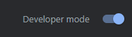
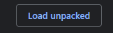
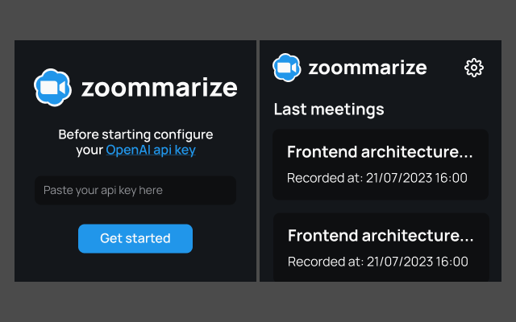
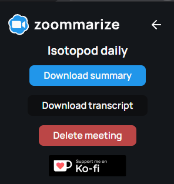

## Available Scripts

In the project directory, you can run:

### `npm run build`

Builds the extension in the `build` folder.

### `npm start`

Builds the extension in the `build` folder and watches for changes.

## Installation

Right now the project is pending for the google web store review. You can install it manually by following the steps below:

1. Download the latest release from [here](https://github.com/androettop/zoommarize/releases)

2. Unzip the file

3. Go to [chrome://extensions/](chrome://extensions/)

4. Enable developer mode:

    

5. Click on "Load unpacked" and select the folder where you downloaded the extension:

    

The extension should be installed now.

## Usage

**Setup**

First, you have to setup an OpenAI api key. You can get one [here](https://platform.openai.com/account/api-keys).

Then, click on the extension icon and paste your api key.

The meeting should be recorded once you join it and enabled the subtitles.

**Download summaries**

You can download the summaries by clicking on the extension icon and then on the "Download summaries" button. You can also download the original transcript by clicking on the "Download transcript" button.

> _Note: The extension will only use the openai api key when you request a summary. It will not send any data to the openai api without your consent._
